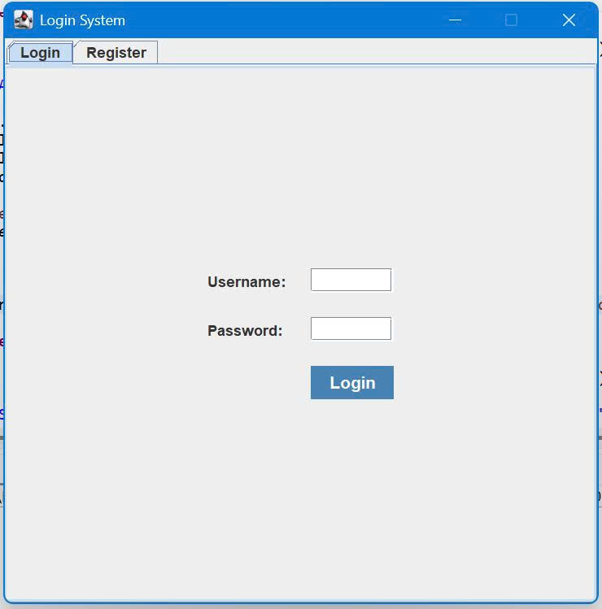
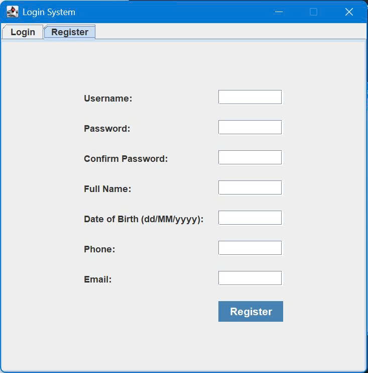
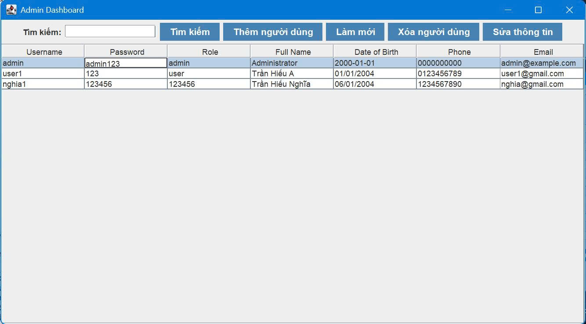
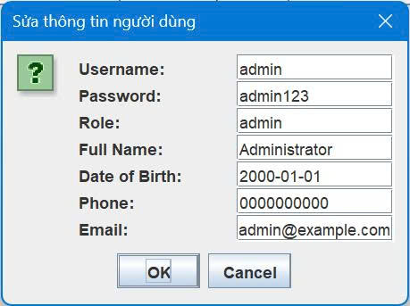
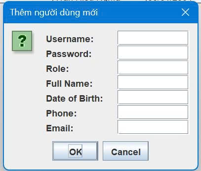
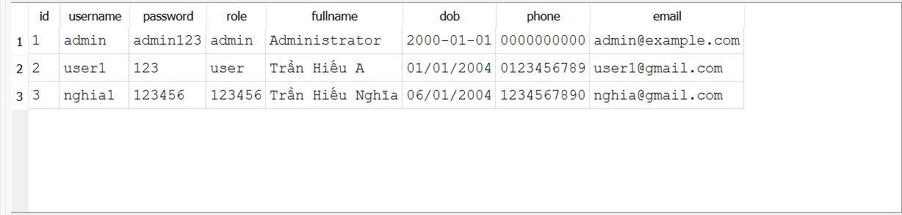

<h2 align="center">
    <a href="https://dainam.edu.vn/vi/khoa-cong-nghe-thong-tin">
    🎓 Faculty of Information Technology (DaiNam University)
    </a>
</h2>
<h2 align="center">
   HỆ THỐNG ĐĂNG NHẬP CLIENT-SERVER
</h2>
<div align="center">
    <p align="center">
        
        
        
    </p>

[](https://www.facebook.com/DNUAIoTLab)
[](https://dainam.edu.vn/vi/khoa-cong-nghe-thong-tin)
[](https://dainam.edu.vn)

</div>

## 📖 1. Giới thiệu hệ thống

Đây là một hệ thống đăng nhập Client – Server viết bằng Java + SQLite, hỗ trợ cả người dùng thường (User) và quản trị viên (Admin).
Mục tiêu: xây dựng ứng dụng mô phỏng việc đăng ký, đăng nhập, quản lý tài khoản người dùng với giao diện trực quan (Swing).

## ⚙️ Các chức năng chính

### - Đăng nhập

* Người dùng nhập tên đăng nhập & mật khẩu.
* Server kiểm tra thông tin trong cơ sở dữ liệu (SQLite).
* Nếu hợp lệ → trả về role (`ADMIN` hoặc `USER`).

### - Đăng ký tài khoản (Register)

* Thêm người dùng mới vào database.
* Các trường thông tin: `username, password, role, fullname, dob, phone, email`.

### - Màn hình sau đăng nhập

* **User** → vào màn hình chung đơn giản (hiện lời chào, nút đăng xuất).
* **Admin** → chuyển sang **Admin Dashboard**.

### - Admin Dashboard

* Xem danh sách tất cả user (hiển thị bằng `JTable`).
* Chức năng quản lý:

  * ➕ **Thêm người dùng** (qua form nhập dữ liệu).
  * ✏️ **Cập nhật người dùng**.
  * 🗑️ **Xóa người dùng**.
  * 🔍 **Tìm kiếm người dùng** theo `username`.
* Các nút thao tác bố trí phía trên bảng, dễ sử dụng.

### - Đồng bộ Client – Server

* Client gửi lệnh qua socket (`LOGIN|...`, `REGISTER|...`, `GET_ALL_USERS`, …).
* Server xử lý và trả kết quả → Client cập nhật giao diện.

### - Cơ sở dữ liệu SQLite

* Bảng `users` lưu trữ toàn bộ thông tin.
* DB có thể mở trực tiếp bằng **DB Browser for SQLite** để kiểm tra dữ liệu.

## 🔧 2. Công nghệ sử dụng
- **Ngôn ngữ lập trình:**

   * **Java** (JDK 8+), làm nền tảng chính để xây dựng cả **Client** và **Server**.
   * Ưu điểm: đa nền tảng, dễ dàng kết nối với cơ sở dữ liệu, hỗ trợ mạnh về socket và giao diện.

- **Giao tiếp Client – Server:**

   * **Java Socket Programming** (`ServerSocket`, `Socket`, `InputStream`, `OutputStream`).
   * Mỗi yêu cầu từ client được server xử lý theo giao thức tự định nghĩa (ví dụ: `LOGIN|username|password`).

- **Cơ sở dữ liệu:**

   * **SQLite** – CSDL nhẹ, nhúng trực tiếp vào ứng dụng.
   * Truy vấn dữ liệu bằng **JDBC** (`java.sql.Connection`, `PreparedStatement`, `ResultSet`).

- **Giao diện đồ họa:**

   * **Java Swing** (`JFrame`, `JPanel`, `JTable`, `JButton`, `JTextField`, `JPasswordField`).
   * Dùng để xây dựng:

     * Form đăng nhập/đăng ký.
     * Admin Dashboard (hiện bảng người dùng, CRUD, tìm kiếm).
     * Màn hình User sau đăng nhập.

- **Công cụ hỗ trợ:**

   * **DB Browser for SQLite**: kiểm tra, chỉnh sửa và xem dữ liệu trực quan.
   * **Eclipse/IntelliJ IDEA/NetBeans**: IDE để phát triển và chạy project.


## 🚀 3. Hình ảnh các chức năng

<p align="center">
  <figcaption> Giao diện đăng nhập </figcaption>
  
</p>

<p align="center">
  <figcaption> Giao diện đăng ký dàng cho người dùng </figcaption>
  
</p>

<p align="center">
  <figcaption> Giao diện quản lý người dùng của admin </figcaption>
  
</p>

<p align="center">
  <figcaption> Giao diện sửa thông tin người dùng </figcaption>
  
</p>

<p align="center">
  <figcaption> Giao diện thêm người dùng trực tiếp của admin </figcaption>
  
</p>

<p align="center">
  <figcaption> Database người dùng </figcaption>
  
</p>


## 📝 4. Hướng dẫn cài đặt và sử dụng

## 1. Cài đặt môi trường

Trước khi chạy dự án, cần chuẩn bị:

* **Java Development Kit (JDK)** 8 trở lên

  * Tải tại: [https://adoptium.net/](https://adoptium.net/)
  * Kiểm tra bằng lệnh: `java -version`
* **Git** để tải mã nguồn từ GitHub

  * Tải tại: [https://git-scm.com/](https://git-scm.com/)
  * Kiểm tra bằng lệnh: `git --version`
* IDE đề xuất: **IntelliJ IDEA** hoặc **Eclipse**

## 2. Tải dự án từ GitHub

1. Mở terminal hoặc cmd.
2. Chạy lệnh sau để tải dự án:

   ```bash
   git clone <https://github.com/nghia5s/LTM_He_thong_dang_nhap_Client-Server.git>
   ```
3. Truy cập vào thư mục dự án:

   ```bash
   cd <ten-thu-muc-du-an>
   ```

## 3. Mở dự án trên IDE

1. Mở IDE (IntelliJ hoặc Eclipse).
2. Chọn **Open Project** và chọn thư mục vừa tải về.
3. Đợi IDE load toàn bộ cấu trúc dự án.

## 4. Chạy Server

1. Mở file `server.java` trong package `login`.
2. Nhấn **Run** để chạy.
3. Console sẽ hiện thông báo `Server đang chạy trên cổng 12345`.

## 5. Chạy Client

1. Mở file `client.java` (hoặc file giao diện Client).
2. Nhấn **Run** để khởi động giao diện đăng nhập.
3. Đăng nhập bằng tài khoản:

   * Admin mặc định: `admin` / `admin123`

## 6. Tính năng

* Đăng nhập và đăng ký tài khoản mới.
* Admin đăng nhập để xem danh sách user.
* Admin có thể xóa tài khoản người dùng.

Vậy là bạn đã tải và chạy thành công hệ thống đăng nhập Client–Server.


## Thông tin cá nhân
**Họ tên**: Trần Hiếu Nghĩa.  
**Lớp**: CNTT 16-03.  
**Email**: nt313201@gmail.com.

© 2025 AIoTLab, Faculty of Information Technology, DaiNam University. All rights reserved.
